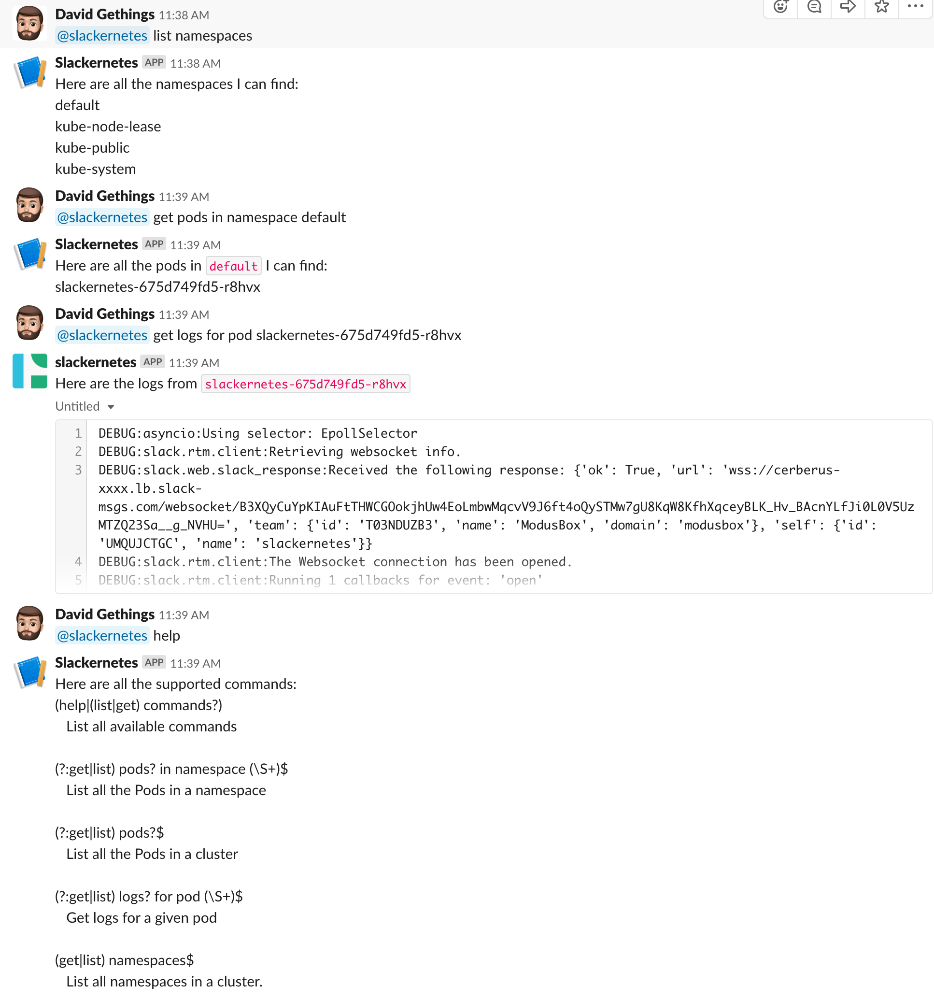

# Slackernetes

ChatOps bot for Devs to get info on their Kubernetes deployments.



## Installation

Create a [Slack App](https://api.slack.com/apps). Add a Bot User and install the app to your workspace.

Then install the bot into the cluster use Helm.

```bash
helm install --name slackernetes helm/slackernetes --set-string=bot_oauth_token <Slack API Bot User Token>
```

## Development Setup

To run Slackernetes in Minikube do the following.


```bash
eval $(minikube docker-env)
docker build --rm -f "Dockerfile" -t slackernetes:latest .
helm install --name slackernetes helm/slackernetes --set-string bot_oauth_token=<Slack API Bot User Token> --set-string log_level=DEBUG
```
